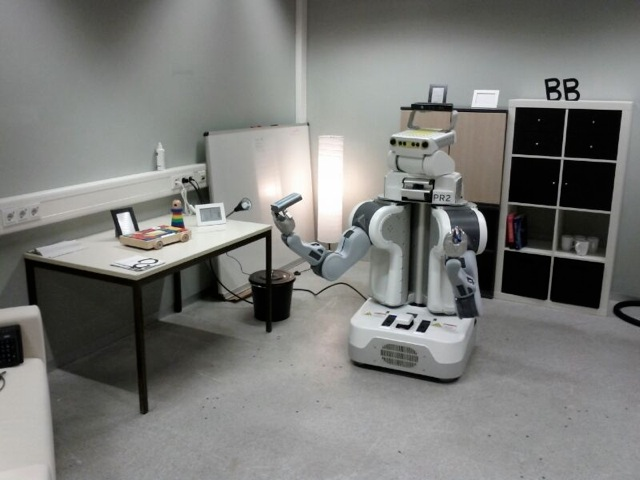
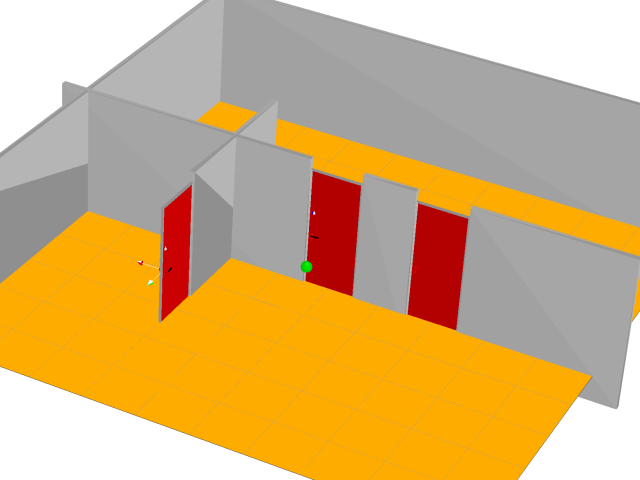

# The Curious Robot

**The Curious Robot** (TCR) is about the challenge of gaining controllability
over external DoFs in complex environments, i.e., exploring and learning the
environment and building a model of the world with the affordances of the
objects in the world.

  
  

## The Method

We approximate the belief with a *physics simulation* and focus on *learning
the geometry and kinematic structure* of the environment, i.e., we learn the
object type (static, free, articulated) and its properties (joint type, pose,
limits, etc.).  Probability distributions are used for the types and properties
of the objects.  The exploration is guided by active learning and maximazing
the information gain.

### Modes and strategies of exploration

The robot must learn how to find DoFs (**exploration for discovering DoFs**)
and how to manipulate them (**exploration for modeling DoFs**). The strategies
can be different depending on the object type.

The exploration is guided by **active learning** and maximizing the **information gain**.

## Setup & Experiments

TCR is done in simulation and in the real world with our PR2 *BigBird* (work
in progress).
In the **simulation** the robot, a flying ball/just an end-effector, explores the
world which consists of a room (walls, doors, handles, etc.).
In the **real world scenario**, our PR2 *BigBird* explores a living room (doors,
drawers, handles, toys, blocks, (light) switches, pens, etc.).

### Example: Belief Update

Here, you can see how the belief of the robot is iteratively updated.

  
  
  

  
  
  

## Poster

For more information download the Poster of TCR which was
presented at the
[Machine Learning Summer School 2013](http://mlss.tuebingen.mpg.de/)
(MLSS 2013) in Tübingen, Germany.

